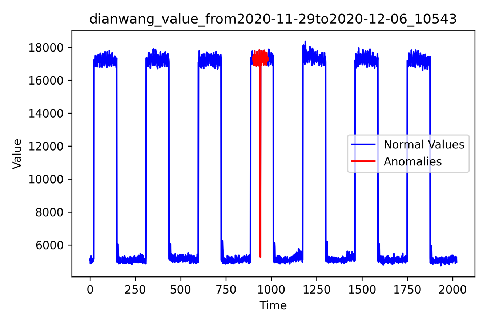
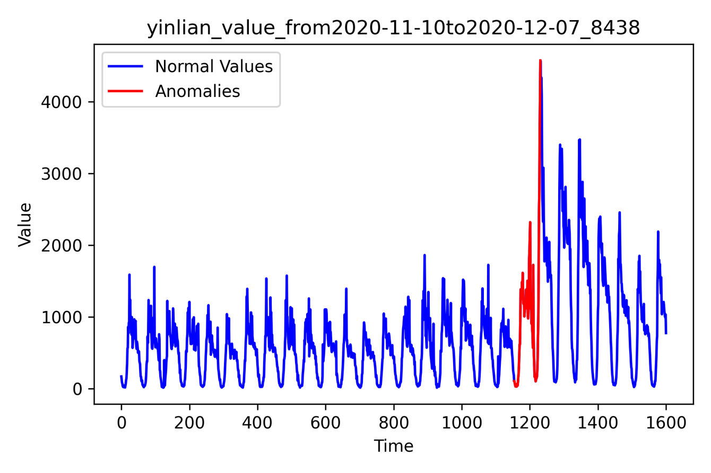
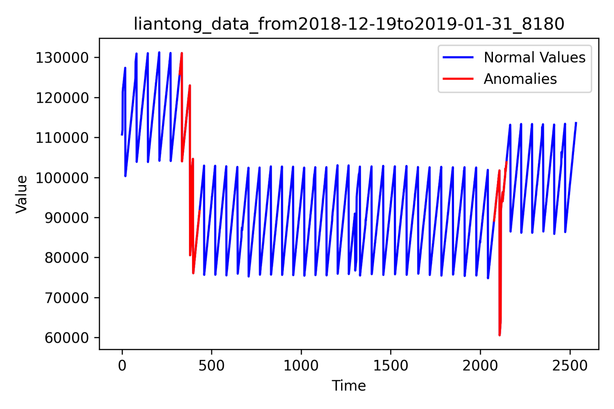
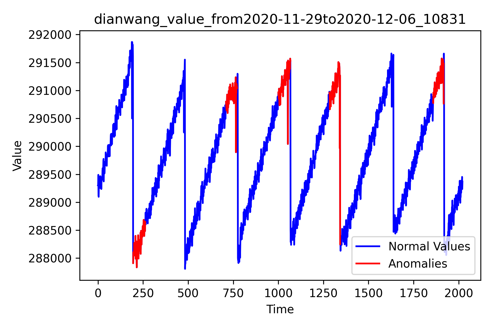
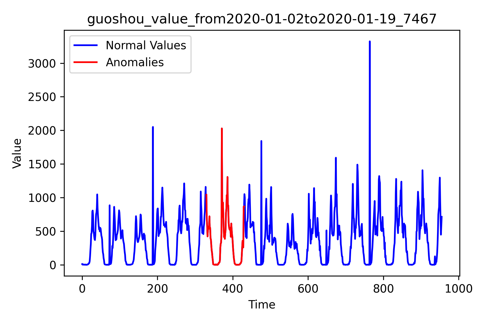

# 实验结果

## 实验准备

- Apache IoTDB 
- 硬件环境：
  - OS: Ubuntu 22.04.5 LTS x86_64
  - CPU: AMD EPYC 7542 (128) @ 2.900GHz
- 数据集：
  - 电网数据集
  - 通信数据集
  - 银联数据集

## 实验优势

- 实验结果中，Matrix Profile在以下场景的检测中表现较好：
  - 子段形状异常
  - 变化点，短期波动异常
  - 趋势变化位置

## 方法不适用场景

- 该算法不适合于检测：
  - 重复出现的异常模式
  - 波动明显模式中的单点异常

